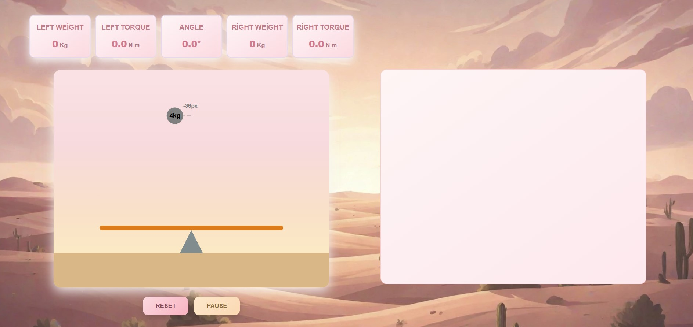
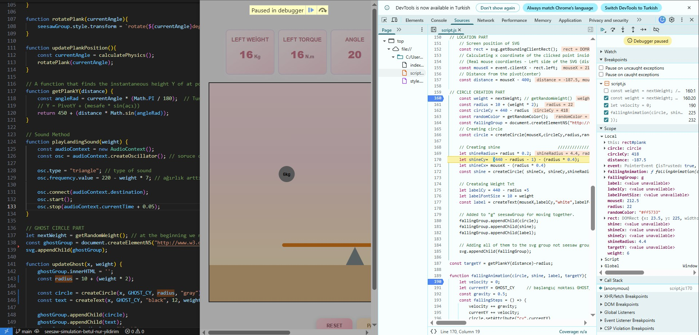

# Seesaw Physics Simulator
 

 
🔗 

 
---
## Project Summary
This project is an interactive physics simulation where users can drop randomly weighted balls onto a seesaw by clicking directly on the plank.  
The simulation calculates balance in real time, allowing users to observe how different weights and distances influence the tilt and torque of the system.
The primary goal of this project is to understand the requirements of a given case carefully, combine my creative ideas, design the steps and structure of the project, implement them based on the design, and apply tests to prove it working exactly as it was defined at the beginning.
 
---
## 1. Features
 
### Interactive User Interface
- Users can drop balls of weights in range 1-10 onto the seesaw plank with a click on the plank.
- The simulation reacts immediately to every interaction.
 
### Real-time Physics Engine
- Custom-built logic calculates torque dynamically based on each ball’s position on the plank.
- The seesaw tilt angle is updated proportionally and limited at +30 and -30.
 
### Dynamic Weight System
- Objects are generated with random weights between 1 to 10 kg.
- The visual size of each ball and its text label scale automatically according to its mass.
 
### Advanced Animations
- **Gravity Simulation:** Balls fall with realistic acceleration.
- **Inclined Plane Synchronization:** Using trigonometric calculations, balls land precisely on the plank even when it is tilted and move in sync with the plank’s rotation.
 
### State Persistence (LocalStorage)
- Every placed ball and the current balance state are saved automatically.
- Users do not lose their progress when the page is refreshed.
 
### Enhanced User Experience (UX)
- **Ghost Ball Preview:** A silhouetted preview follows the cursor, displaying the next weight and its drop position before clicking.
- **Distance Indicator:** Shows the exact distance from the pivot once a ball is placed.
- **Event Logs:** A dedicated panel records every action, including dropped weight, side, and distance.
- **Live Data Dashboard:** Displays total weight and torque for both the left and right sides, along with the current tilt angle.
 
### Simulation Controls
- **Reset Button:** Clears all objects from the screen and removes all LocalStorage data.
- **Pause / Continue Button:** Allows users to freeze the simulation and prevents new balls from being dropped until resumed.
 
## 2. PLANNING:
 
### 2.1 Requirements & Technical Restrictions
Before coding, the core physics requirements were defined and strict technical boundaries were set.
- **No Frameworks or Libraries**  
  No external tools such as React, p5.js, GSAP, or similar libraries were used.
- **Pure Logic Implementation**  
All physics calculations, animations, and state management are implemented using **Vanilla JavaScript, HTML, and CSS**. It was specifically emphasized in the document.
- **No Canvas**  
Using Canvas was not allowed, so another great option "SVG" is used instead for seesaw animation.
 
### 2.2 Tool Selection: Why SVG?
After evaluating the restrictions, SVG (Scalable Vector Graphics) was chosen because:
- **DOM Integration:** Every element is represented as a DOM node, making it easier to attach event listeners directly (e.g., clicking only on the plank).
- **Fine-Grained Element Control:**  
  Individual SVG elements can be accessed, updated, and animated independently. This makes it possible to rotate the plank, moving balls position, and update visual states without needing to redrawing the entire scene.
- **Accessibility and Styling Flexibility:**  
  SVG elements can be styled using CSS, enabling better accessibility and easier visual customization.
- **Scalability:** SVG maintains perfect clarity across different zoom levels and screen sizes.
 
## 3. DESIGN:
The project is structured with a simple directory layout. All JavaScript source files are placed under a scripts folder, while static asset such as images are organized under an assets directory. The root directory contains only the main HTML and CSS files. This structure keeps the entry files easily accessible and separates application logic from presentation layer.
 
### 3.1 Modular Architecture
The project follows a modular architecture with javascript logic separated into relevant files, abiding to responsibility. (physics, storage, etc.).  **9 distinct modules**: 
seesaw-physics-simulator/
    ├── index.html # Main HTML structure
    ├── style.css # Global styles and layout
    ├── README.md
    ├── assets/
    │   └── desert_expanded.png # Background image
    └── scripts/
        ├── main.js # Application entry point
        ├── config.js # Central configuration and state management
        ├── user-actions-handler.js # User interactions and event handling
        ├── calculations.js # Physics calculations (torque, angle, position)
        ├── animation.js # Animation logic and physics simulation
        ├── svg-factory.js # SVG element creation and manipulation
        ├── dom-access.js # DOM updates and UI panel management
        ├── storage.js # Browser localStorage persistence
        └── audio.js # Sound generation using Web Audio API
 
### 3.2 Event Flow
User Mouse Move → Update Ghost Circle
User Click → Create Ball → Start Fall Animation → Calculate Landing → Update Physics → Play Sound → Update UI
Leave Page → Save state to local storage
Load Page → Load state from local storage and upload to DOM
 
 
## 4. IMPLEMENTATION
### 4.1 UI
Visual design was given particular attention in order to create an aesthetic visual space.
- Linear gradients (for background coloring) and box shadows were applied in CSS to add depth and visual hierarchy to the panels and SVG area. Also, AI-generated background image was used to enrich the overall visual experience.
- To improve user interaction, a subtle sound effect was triggered when a ball lands on the seesaw.
- Media queries ensured responsive behavior across different screen sizes.
 
### 4.2 Core JavaScript Logic
- Inside animation.js fallingAnimation method, Gravity force and velocity accumulation used to simulate a realistic object falling behavior. Incremental state updates triggered only after animation completion to avoid unnecessary recalculations. It was implemented using a controlled recursive function pattern. Instead of traditional loops, the animation function calls itself through requestAnimationFrame, allowing each frame to be calculated step by step.
- Inside svg-factory.js, the createCompleteCircle method is decomposed into three smaller helper functions: createCircle, createShine, and createCircleText. This approach improves readability and keeps each function focused on a single responsibility.
 
### 4.3 Rendering Strategy
- **SVG-based graphics:** Rendering is delegated to the browser’s native SVG engine instead of manual drawing logic (using <rect>, <circle>, <line> elements).
- **Group transformation:** Related SVG elements are grouped (Using SVG <g> elements )and transformed as a single unit, allowing efficient and consistent rotation around a defined pivot point.
- **Ghost preview:** A ghost preview element provides visual feedback by following the cursor position before the object is placed.
 
### 4.4 Performance Optimizations 
- **RequestAnimationFrame:** Animations avoid setInterval and setTimeout and instead use requestAnimationFrame to stay synchronized with the browser’s rendering cycle. This approach enables smoother animations, targets approximately 60 FPS, and automatically pauses updates when the tab is in the background.
- **Event Delegation:** Event handling is centralized using event delegation to reduce the number of active listeners(Listener is <svg>).
- **Incremental Calculations:** Torque calculations are performed incrementally. When a new ball is added, only its torque contribution is calculated and added to the existing total, rather than recalculating torque for all balls.
 
### 4.5 Steps
The project was developed in a step-by-step manner so that 1 feature was completely handled and implemented correctlybefore diving to the next.
 
** Step 1: Creating the SVG World **
The development process began with setting up the SVG environment.  
The HTML tags, background layers (sky, ground), and coordinate system were defined to establish a consistent visual and mathematical space for simulation.
** Step 2: Drawing the Seesaw **
The seesaw structure then created using basic SVG elements.  
The pivot and plank were positioned in their exact coordinates, and the transform origin was precisely centered to ensure correct and realistic rotation behavior.
** Step 3: User Interactions **
After the visual structure was completed, user interaction logic was introduced.  
Click positions on the plank were detected with event handling callback functions, and objects were dynamically spawned at the corresponding locations based on user input.
** Step 4: Physics & Torque Calculation **
The core physics logic was implemented next.    
Torque calculations were based on the moment formula (W × D), and trigonometric adjustments were applied to solve the slope challenge, allowing objects to land on the current point on tilted surfaces.
** Step 5: Animation & Persistence **
In the final step, animation and persistence features were added.  
Falling and rotating animations were refined for smooth motion, and LocalStorage was integrated to preserve the simulation state across browser sessions. And with the pause and reset features, better user experience was achieved.
 
## 5. DEBUGGING - TESTING
 Chrome dev tools debugging console was used for:
Fixing bugs by tracing the flow of the code line by, detecting the point where failure is caused.
Testing the functions carefully in run time, tracking the state (variables) end to end to ensure everything works properly as expected.
 

 
 
## 6. DEPLOY
Static content was easily deployed on Github Pages: Live Demo. 
 
## 7. AI USAGE 

During this project, AI (Claude/ChatGPT/AI Studio) acted as a technical mentor and co-pilot. Here is how I utilized it:
Debugging Assistance: I asked some technical knowledge problems to AI, rather than searching on web. For example when the balls "jumped" or "glitched" during the handover from the falling animation to the seesaw group, I used AI to explain the differences between global and local coordinate spaces, which was about the "transfer logic" of SVG.
Styling recommendation: Used AI for style recommendations, asking for what kind of CSS utilities enable beautiful user experience (like linear gradient, box shadow etc.).
Documentation structure advice: Asked AI how may be some part of the documentation structure be, like title recommendations etc.
## 8. AI Tradeoffs & Limitations

Every technical project involves making choices. During the development of this simulation, I made several strategic trade-offs:
Fixed Viewport: I deciding design details were a bit challenging. Initially I set the SVG size to 800x600. Later I, after the project grew, I decided it was too large to fit the page, so I decided to adjust it to 600x475, but it was not easy. I had to change multiple parts of the project to abide to new adjustment. Later I overcome this problem by centralizing these configurations to constant global variables in config.js file (PLANK_LENGTH, PLANK_START etc.). So the right thing to do was foreseeing this as a potential issue and take action in the beginning by centralizing configurations.
Animating the balls rotation: After the balls fall on the plank, they should animate by rotation on the plank together with the plank, protecting its position, during the tilt angle update of the plank. This was not easy to achieve during the development. To update them individually every time was a burden both by development and computationally for CPU. So I learned that SVG has a feature for this, that is adding elements of SVG (plank rectangle and fallen balls) to a group. And rather than transforming only the planks angle, transformation of the whole group solved this problem. And of course trigonometric calculation was necessary to prevent wrong dropping on plank point calculations for the falling balls.
Time Limitation: If only I had more time left, I had some other beautiful features to add in my mind, like changing the theme of the background via a popup panel on the side, one option making back ground color as a desert theme, other making winter theme, other a green amazon jungle environment etc.
 
 